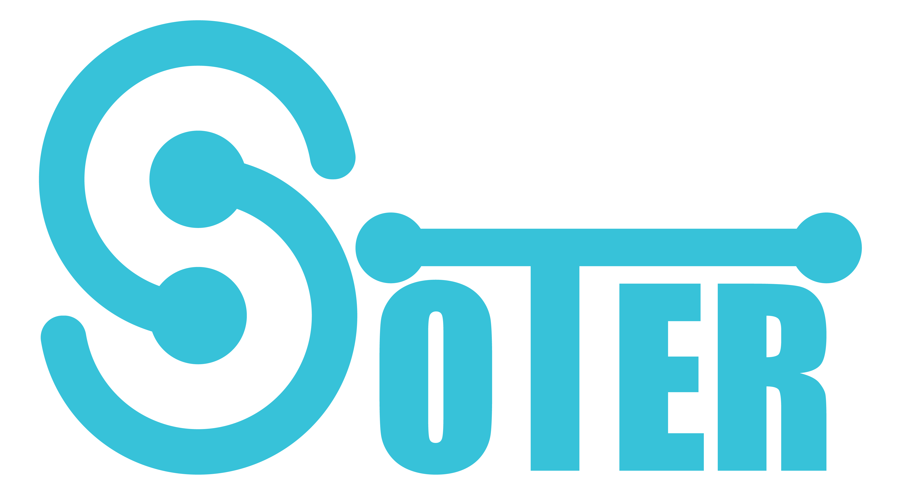
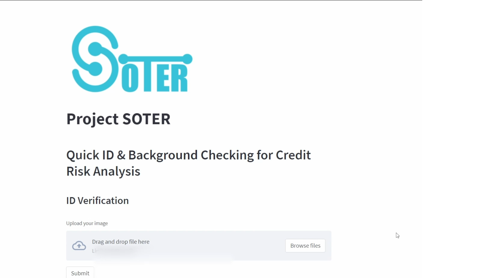
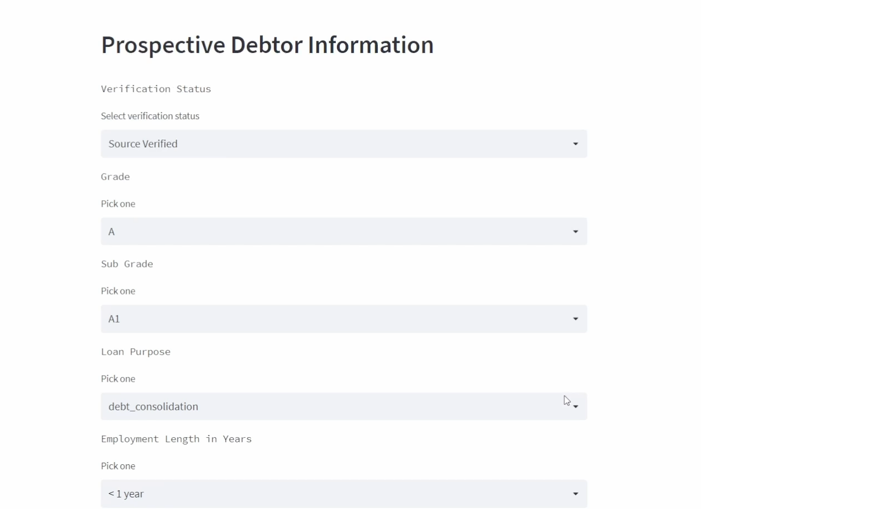

# Soter

  

**Soter** adalah suatu sistem yang akan mampu mempercepat proses penentuan diterima atau ditolaknya pinjaman serta meningkatkan efisiensi review pengajuan pinjaman dengan algoritma machine learning dan deep learning.

## Latar Belakang 

Menurut survei statistik fintech lending oleh OJK dan Survei Perbankan oleh BI, industri finansial dan perbankan memiliki trend pengajuan pinjaman yang terus meningkat. 

Masalahnya adalah proses review penetuan diterima atau ditolaknya suatu pinjaman sangat lama berkisar 4-14 hari. Mayoritas industri menggunakan masih menggunakan review manual. Sehingga cost analisis resiko masih tinggi.

Project soter menawarkan sebuah sistem yang akan mampu mempercepat proses penentuan diterima atau ditolaknya pinjaman serta meningkatkan efisiensi review pengajuan pinjaman dengan algoritma machine learning dan deep learning. sehingga kita dapat menghindari meloloskan calon debitur bermasalah yg dapat menjadi potensi yang merugikan industri.

## Objective

Dari penjelasan sebelumnya, kami kemudia menentukan tujuan dan pemecahan masalahnya meliputi :

1. Membuat sistem yang dapat mendeteksi wajah yang tertera di ID card dengan aslinya.
2. Membuat model yang dapat menentukan calon peminjam layak atau tidak diberi pinjaman. 

## Cara Menggunakan Aplikasi
1. Face Recognation

  
  

  Tampilan dari laman beranda face recognation.

2. Background Checking

  
  

  Tampilan dari laman beranda background checking.

